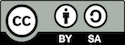
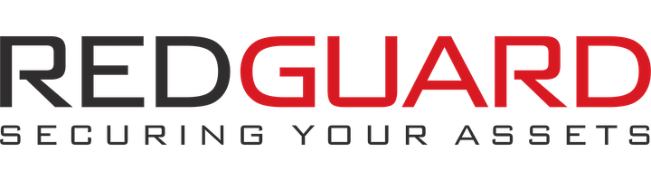

# 扉

## 本標準について

コンテナセキュリティ検証標準はアーキテクト、開発者、テスト担当者、セキュリティ専門家、利用者がセキュアなコンテナおよび対応するインフラストラクチャを定義するために使用できるセキュリティ要件またはテストのリストです。

## 著作権とライセンス

Copyright © 2019 OWASP Foundation. このドキュメントは Creative Commons Attribution ShareAlike 4.0 license に基づいてリリースされています。再利用または配布する場合には、他者に対して本著作物のライセンス条項を明らかにする必要があります。

CSVS ドキュメントと構成をビルドするために使用されるコードは OWASP ASVS プロジェクトをベースにしています。

## 寄稿

本標準内に対処すべき問題を見つけた場合:

* 本標準のデザイン
* 失われたコントロール
* 無効または古いコントロール
* 不明瞭な文言、スペル、文法の問題
* フォーマットの問題
* 翻訳の問題 – コントロールの文言があなたの言語で表現しようとすることが困難または不可能になるようなものである場合には、お知らせください。スペイン語やタイ語で機能しない場合は、おそらく英語でも機能していません。
* 翻訳のオファー – あなたの言語にすでに取り組んでいる人を紹介できるように、私たちにお知らせください。

すべての問題は https://github.com/OWASP/Container-Security-Verification-Standard/issues にログ記録してください。

## 寄稿者

| 筆頭著作者 | 執筆者およびレビュー担当者 |
| --- | --- |
| Sven Vetsch | Alexander Hermann, Dominik Nufer, Dominique Meier, Patrick Schmid, Daniel Tschabold |

   

本プロジェクトの後援に感謝します:

