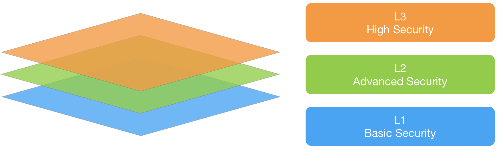

# CSVS の使い方

CSVS には二つの主要な目標があります。
* 組織がセキュアなコンテナとコンテナインフラストラクチャを開発および保守するのに役立つこと。
* セキュリティサービス、セキュリティツールベンダ、利用者が要件とサービス・製品を調整できるようにすること。

## コンテナセキュリティ検証レベル
コンテナセキュリティ検証標準では三つのセキュリティ検証レベルを定義しており、レベルごとに深さを増していきます。

* CSVS レベル 1 はすべてのコンテナプロジェクトを対象としています。
* CSVS レベル 2 は追加の保護が必要となる、機密データやビジネスロジックを処理するコンテナプロジェクトを対象としています。
* CSVS レベル 3 は価値の高いトランザクションを実行したり、機密性の高い個人情報や医療データを含んだり、最高レベルの信頼を必要とするコンテナがある、最も重要度が高いコンテナプロジェクトを対象としています。

各 CSVS レベルにはセキュリティ要件のリストが含まれています。これらの各要件はコンテナまたはその基盤となるインフラストラクチャに組み込む必要があるセキュリティ固有の機能や能力にマップすることもできます。

図 1 - コンテナセキュリティ検証標準レベル

## 本標準の使い方

コンテナセキュリティ検証標準を使用する最良の方法の一つは、プロジェクト、プラットフォーム、または組織に固有のチェックリストを作成するための青写真として使用することです。ユースケースに合わせて CSVS を仕立て直すことで、プロジェクトや環境にとって最も重要なセキュリティ要件に焦点を当てることになります。

### レベル 1: 導入 (Opportunistic)

発見や悪用が容易な既知のセキュリティ脅威に対して適切に防御している場合、コンテナベースのインフラストラクチャ/ソリューションは CSVS レベル 1 (導入) を満たします。

レベル 1 は一般的に可用性を含むセキュリティコントロールを正しく使用するための低い信頼性のアプリケーションに適しています。また、エンタープライズアプリケーション群の迅速な分析を提供することや、マルチフェーズの取り組みの一環としてセキュリティ要件の優先リストの開発を支援することに適しています。私たちは レベル 1 をすべてのコンテナプロジェクトに最低限必要であると考えています。コンテナベースのソリューションにより処理されるデータに高い価値がある場合、レベル 1 レビューで止めたくはないでしょう。

### レベル 2: 標準 (Standard)

今日のコンテナベースのソリューションに関連するリスクのほとんどに対して適切に防御している場合、コンテナベースのインフラストラクチャ/ソリューションは CSVS レベル 2 (標準) を満たします。

レベル 2 はセキュリティコントロールが準備され、効果的で、テストされ、ソリューション全体で使用されていることを確認します。レベル 2 は一般的に、機密情報の処理、ビジネス上重要または機密性の高い機能の実装、その他の機密資産の処理など、重要かつ機密性の高いトランザクションを処理するコンテナベースのプロジェクトに適しています。

### レベル 3: 上級 (Advanced)

CSVS レベル 3 は CSVS の中で最高レベルの検証です。このレベルでは一般的に軍事、安全衛生、重要インフラストラクチャなどの分野で見られるような、重要レベルのセキュリティ検証を必要とするコンテナベースのソリューションを想定しています。

障害が組織の運営、さらにはその存続可能性に大きな影響を与える可能性がある重要な機能を実行するアプリケーションに対して、組織は CSVS レベル 3 を必要とすることもあります。高度な攻撃者に対して適切に防御し、優れたセキュリティ設計の原則を実証している場合、コンテナベースのソリューションは CSVS レベル 3 (上級) を満たします。

CSVS レベル 3 のアプリケーションでは他のすべてのレベルよりも詳細な分析、アーキテクチャ、コーディング、およびテストが必要です。セキュアなコンテナインフラストラクチャは (耐性、スケーラビリティ、そして何よりセキュリティ層の一助とするため) 意味のある方法でモジュール化され、(ネットワーク接続や物理インスタンスにより分離されている) 各モジュールはそれ自身のセキュリティ責任を果たし (多層防御) 、適切に文書化およびテストする必要があります。責任には機密性 (暗号化など) 、完全性 (トランザクション、入力妥当性確認など) 、可用性 (負荷の適切な処理など) 、認証 (システム間を含む) 、否認防止、認可、監査 (ログ記録) を確保するためのコントロールを含みます。

## CSVS を実際に適用するには

脅威が異なれば動機も異なります。業界によっては固有の情報資産や技術資産があり、ドメイン固有の法令遵守要件があります。業界ごとにいくつかの固有の基準と脅威の相違がありますが、すべての業界セグメントに共通のテーマは、日和見的な攻撃者は容易に悪用可能な脆弱性を探している、ということです。そのため、業界に関係なくすべてのコンテナベースのプロジェクトに CSVS レベル 1 が推奨されます。

組織は事業の性質に基づいて自社に固有のリスク特性をより綿密に調査することが強く求められます。対極にあるのが CSVS レベル 3 で、生命の安全を脅かしかねない場合やアプリケーションが完全に侵害された際に組織へ甚大な影響が及ぼしうる場合に対応しています。

## ユースケース

### 詳細なセキュリティアーキテクチャガイダンスとして

コンテナセキュリティ検証標準のより一般的な用途の一つにセキュリティアーキテクトのリソースとしての利用があります。二つの主要なセキュリティアーキテクチャフレームワーク SABSA と TOGAF には、アプリケーションとコンテナのセキュリティアーキテクチャレビューを完了するために必要な情報が非常に不足しています。CSVS はセキュリティアーキテクトが一般的な問題に対してより適切なコントロールを選択できるようになるため、これらのギャップを埋めるために使用できます。

### 既製のチェックリストの代わりとして

多くの組織は三つのレベルのうち一つを選択するか、CSVS をフォークしてドメイン固有の方法で各リスクレベルに必要なものを変更することにより、CSVS を採用することで利益を得ることができます。トレーサビリティが維持されている限り、このようなフォークをお勧めします。

### セキュリティトレーニング用として

CSVS はセキュアなコンテナインフラストラクチャの特性を定義するためにも使用できます。多くのセキュリティコースは運用上のヒントを少し付加した単なる倫理的ハッキングコースです。セキュリティトレーニングではベストプラクティスに関する技術を習得するために、プロアクティブコントロールに重点を置く CSVS を使用できます。
